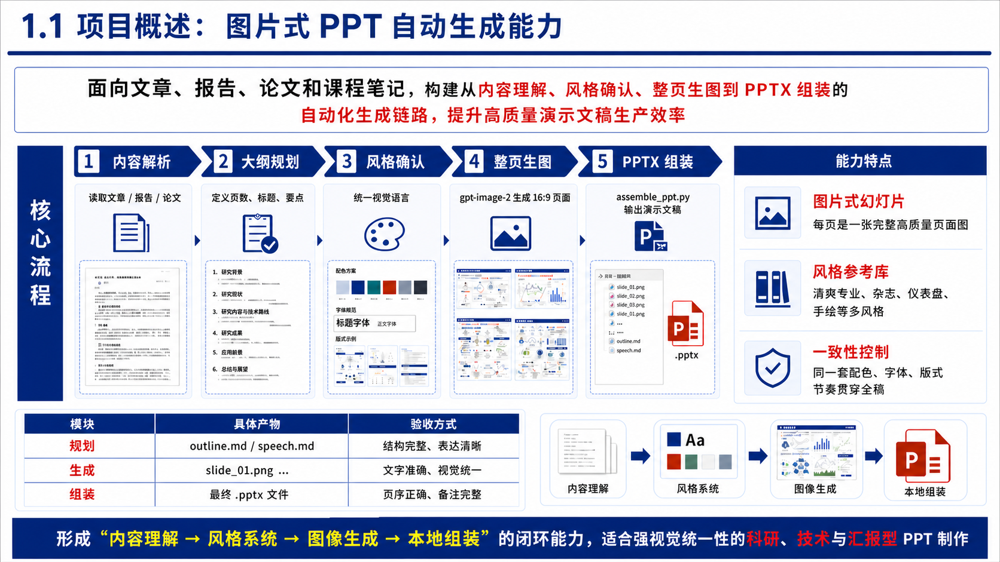
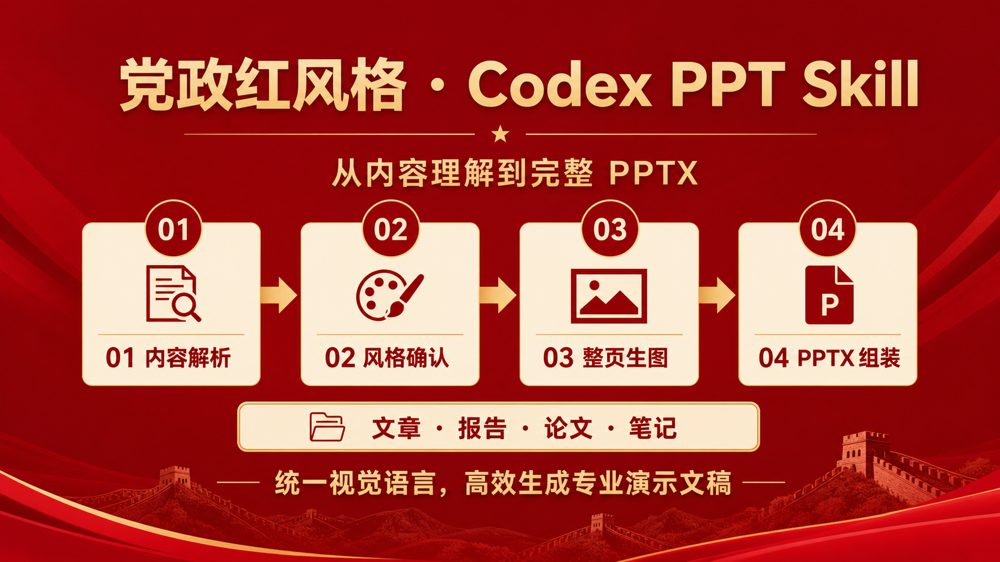
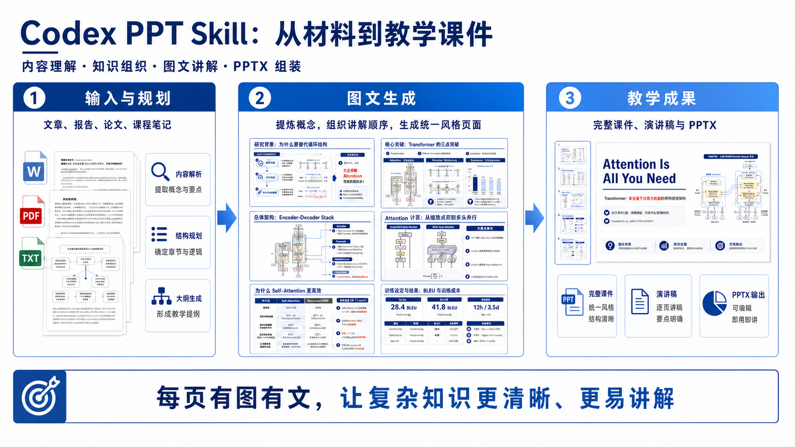

# Codex PPT Skill

[](README_en.md) [](https://ningzimu.github.io/codex-ppt-skill/#/) [](https://clawhub.ai/ningzimu/codex-ppt) [](https://app.clawmama.run/skills/5lak48/hermes?utm_source=github&utm_medium=issue&utm_campaign=skill_outreach_ningzimu_codex_ppt_skill) [](https://github.com/ningzimu/codex-ppt-skill/stargazers) [](https://github.com/ningzimu/codex-ppt-skill/forks)

一个面向 Codex 的 PPT 生成 skill，也可在 Claude Code、OpenClaw、Hermes Agent 等支持 `SKILL.md` 的 agent 中使用；在这些非 Codex 环境中通常需要配置 `gpt-image-2`、第三方生图 API 或 OpenAI 兼容格式的生图接口。它把文章、报告、论文、课程笔记等内容转换成“整页图片式”的演示文稿：先规划大纲和视觉风格，再生成每页幻灯片图片，最后用本地脚本组装为 `.pptx`。

## 赞助

<table>
<tr>
<td width="180"></td>
<td>感谢 <a href="https://www.atlascloud.ai/?utm_source=github&utm_medium=link&utm_campaign=codex-ppt-skill">Atlas Cloud</a> 赞助本项目。AtlasCloud 是多模态 AI 推理平台，提供统一 API 接入图片生成、视频生成和大语言模型等能力；本 skill 已支持通过现有 API key、base URL 和模型名配置接入 AtlasCloud 的 GPT Image 2 生图和编辑图接口，按量计费，开箱即用。完整模型列表可查看 <a href="https://www.atlascloud.ai/zh/models">Atlas Cloud 模型页</a>。</td>
</tr>
</table>

## 温馨提示

> [!TIP]
> 本 skill 负责从文章、报告、大纲或想法生成图片式 PPT，适合强视觉表达，但页面元素本身不可直接编辑。如果你需要进一步转换成可编辑 PPT，可以在生成完成后尝试使用 [image-to-editable-ppt-skill](https://github.com/ningzimu/image-to-editable-ppt-skill) 进行转换。
>
> 关于 `codex-ppt` 和 `image-to-editable-ppt` 这两个技能的详细介绍，参见 [skill_duo_intro.pdf](assets/skill_duo_intro.pdf)。该 PPT 由 `codex-ppt` skill 生成，提示词为：“请分别阅读 Codex PPT和 Image to Editable PPT 这两个技能的内容，然后用 Codex PPT 帮我做一个PPT吧，20页，每个技能的介绍10页。”
>
> 另外，关于这个 PPT Skill 设计和调优的实践经验，可以看这篇文章：[2000 个 GitHub Star 换来的经验：好的 AI Skill 是调出来的，不是写出来的](https://mp.weixin.qq.com/s/LaxWBX-nogHPpSxlk-Vs8Q)。

> [!NOTE]
> 想查看更多用户用这个 skill 做出的 PPT 效果，可以前往置顶 Issue 的案例展示区：[欢迎分享 codex-ppt 使用案例和 PPT 效果](https://github.com/ningzimu/codex-ppt-skill/issues/34)。

这个 skill 主要给大家提供一个还不错的 PPT 生成流程。为了尽量通用，它的流程设计会稍微复杂一些；复杂也会带来不稳定性或者冗余性。比如它同时兼容 Codex 内置生图和 API/CLI fallback 生图，也会兼容有无子 agent 可用这两种情况，但大部分人日常使用时其实只会固定走其中一条路线。

建议大家在走通自己常用的路线之后，让 AI 帮你改一下这个 skill，把你的偏好固定下来，省得每次都重新选择。比如固定使用内置生图或固定使用某个 API，固定是否使用子 agent，固定常用输出目录、风格、页数节奏等。

另外，如果你在做 PPT 的过程中遇到了自己喜欢的版式或排版，无论是这个 skill 做出来的，还是从别的地方找到的 PPT 风格图片，都可以让 AI 保存到你的个人风格库（`~/.codex-ppt-skill/references/`）里，逐步沉淀自己的风格。个人风格库存放在 skill 安装目录之外，更新或重装 skill 都不会丢失。Skills 本质上是非常个性化的流程，鼓励大家在使用这个 skill 的基础上，按自己的偏好持续调优，让它更适配自己的工作流。

关于 skills 如何设计和使用，可以参考 [good-skill-design.pptx](assets/good-skill-design.pptx)。这个 PPT 也是用本 skill 做的，采用的是手绘技术解释风；内容基于 Claude 在设计 skills 方面的最佳实践文章 [The Complete Guide to Building Skills for Claude](https://resources.anthropic.com/hubfs/The-Complete-Guide-to-Building-Skill-for-Claude.pdf)。祝大家玩得愉快！

## 特点

- 多 agent 可用：支持 Codex、Claude Code、OpenClaw、Hermes Agent 等支持 `SKILL.md` 的环境；最推荐在 Codex 中使用，优先走内置生图和编辑图能力。
- 第三方生图供应商接入：支持 OpenAI 兼容接口、AtlasCloud、`base URL` 和自定义模型名配置，方便通过 API/CLI fallback 使用 `gpt-image-2` 或兼容模型。
- 稳定的阶段化流程：先确认大纲、页数、视觉风格、生图后端和样张，再进入整套生成，降低一次生成完整 PPT 时的返工和偏航。
- 不是无脑生成：会先引导你确认 `outline.md`、每页要点、风格方向和样张效果，再按确认后的方案继续。
- 低门槛输入：文章、报告、论文、课程笔记、Markdown、大纲、PDF、Word 等材料都可以作为起点。
- 内置 12 种 PPT 风格参考：包括清爽专业、科研答辩、党政红、教学课件、电子墨水杂志、手绘技术解释、仪表盘、麦肯锡等；不会写提示词也可以先从内置风格开始，尤其推荐手绘技术解释风。
- 支持自定义风格复刻：可以上传喜欢的图片、PDF 或 PPT/PPTX，让 agent 先分析配色、版式、字体和视觉元素，再按该风格生成新 PPT。
- 可沉淀个人风格库：生成满意后，可以把当前风格保存到个人风格库（`~/.codex-ppt-skill/references/`），下次直接复用；风格库存放在 skill 安装目录之外，更新 skill 不会丢失，同名时个人风格优先于内置风格。
- 多 agent 并发生成：样张确认后，支持一个子 agent 负责一页，并对文字清晰度、风格一致性和内容完整性做自检，发现问题及时返修。
- 支持指定图片插入：可以要求某一页必须放入论文原图、实验结果图、截图、架构图等素材，并让页面围绕这些图片适配主题和版式。
- 自动生成演讲稿：会生成 `speech.md`，并在组装 PPTX 时写入每页备注，方便直接演示或二次修改。

## 生成效果

下面是一套技术分享 PPT 的生成效果示例。每页都是由 `gpt-image-2` 生成的完整 16:9 幻灯片图片，再由本地脚本组装为 PPTX。


下面是一套论文答辩风案例，来源于论文 [Attention Is All You Need](https://arxiv.org/abs/1706.03762)。它展示了如何在指定页中插入论文原始图片作为输入素材，例如模型架构图、attention 模块图和 attention 可视化图，并围绕这些图片生成统一风格的 PPT（见 Issue #14）。


## 风格示例

以下是已生成预览图的风格，示例图均由 `gpt-image-2` 生成，用于帮助用户在开始制作前选择视觉方向。

| 清爽专业风 | 创意杂志风 |
| --- | --- |
|  |  |
| 电子墨水杂志风 | 数据仪表盘风 |
|  |  |
| 复古扁平插画风 | 手绘技术解释风 |
|  |  |
| 手绘白板风 | 温暖手工风 |
|  |  |
| 科研答辩风 | 麦肯锡风格 |
|  |  |
| 党政红风格 | 教学课件风 |
|  |  |

## 输出结构

每个 PPT 会生成一个独立项目目录：

```text
{基础目录}/{PPT名称}/        # 当前 PPT 的独立项目目录
├── origin_image/           # 正式幻灯片图片目录，只放最终采用的页面
│   ├── slide_01.png        # 第 1 页幻灯片图片
│   ├── slide_02.png        # 第 2 页幻灯片图片
│   └── ...                 # 后续页面图片，按页码顺序命名
├── outline.md              # 经确认的 PPT 大纲、页数、每页标题和要点
├── speech.md               # 演讲稿，会写入 PPT 每页备注
└── {PPT名称}.pptx          # 最终组装生成的 PowerPoint 文件
```

你可以在 `origin_image/` 里查看每一页最终采用的幻灯片图片，文件会按 `slide_01.png`、`slide_02.png` 这样的顺序排列。想预览整套 PPT 的视觉效果，或只挑某一页继续修改时，直接看这里最方便。

`speech.md` 是配套演讲稿。生成 `.pptx` 时，这些内容会自动写入每页 PPT 的备注区，你可以在 PowerPoint 里直接查看、修改，或演示时作为讲稿使用。

## 适用场景

- 技术文章转分享 PPT
- 论文或报告转演示稿
- 课程笔记转课件
- 科研项目申报、中期检查、结题验收和论文答辩
- 商业汇报、产品介绍、调研总结
- 需要强视觉统一性的图片式演示文稿

## 安装

### 一句话安装

【推荐】可以直接把下面这句话发给你的 Agent，让它帮你安装：

```text
请帮我安装这个 codex-ppt skill，链接是：https://github.com/ningzimu/codex-ppt-skill
```

### 手动安装到 Codex

如需手动安装到 Codex，可以使用 `skills` CLI 安装到 Codex 的全局 skills 目录：

```bash
npx -y skills@latest add ningzimu/codex-ppt-skill \
  --skill codex-ppt \
  --agent codex \
  --global
```

安装完成后，重启 Codex 让新 skill 生效。

也可以从 GitHub Releases 下载 `codex-ppt-skill-v*.zip`，解压后把其中的 `codex-ppt` 文件夹放到 `~/.codex/skills/codex-ppt`，然后重启 Codex。

如果你是在本地开发这个仓库，也可以把 skill 目录链接到 Codex skills 目录，方便实时调试修改：

```bash
mkdir -p ~/.codex/skills
ln -s /path/to/codex-ppt-skill/skills/codex-ppt ~/.codex/skills/codex-ppt
```

### OpenClaw

可以通过 ClawHub 安装：

```bash
openclaw skills install codex-ppt
```

ClawHub 页面：[clawhub.ai/ningzimu/codex-ppt](https://clawhub.ai/ningzimu/codex-ppt)

如果使用 OpenClaw 的 skill allowlist，需要把 `codex-ppt` 加入允许列表。

### Claude Code、Hermes Agent

这些 agent 都可以读取 `SKILL.md` 形式的 skill。也可以使用 `skills` CLI 安装：

```bash
# Claude Code
npx -y skills@latest add ningzimu/codex-ppt-skill \
  --skill codex-ppt \
  --agent claude-code \
  --global

# Hermes Agent
npx -y skills@latest add ningzimu/codex-ppt-skill \
  --skill codex-ppt \
  --agent hermes-agent \
  --global
```

常见目标目录是：Claude Code 使用 `~/.claude/skills/codex-ppt`，Hermes Agent 使用 `~/.hermes/skills/codex-ppt`。

如果你是在本地开发这个仓库，也可以用软链接替代复制，方便实时调试修改。

### 更新

重新执行一遍上面对应的安装命令即可覆盖为最新版本，也可以直接让 agent 帮你更新：

```text
请帮我更新 codex-ppt skill 到最新版本，仓库是：https://github.com/ningzimu/codex-ppt-skill
```

更新后重启 agent 生效。API key 配置（`~/.codex-ppt-skill/.env`）和个人风格库（`~/.codex-ppt-skill/references/`）都在 skill 安装目录之外，更新或重装不会丢失。

## 生图模型配置

> [!TIP]
> 你可以先正常使用 Codex PPT 开始制作 PPT。一般不需要自己手动配置生图模型；当流程走到“选择生图后端”时，AI 会根据当前环境判断是否需要配置，并在需要时引导你提供相关信息。
>
> - 如果你使用的是 Codex 内置图片生成能力，通常不需要额外配置 API key。
> - 如果你确定要使用第三方供应商或 OpenAI 兼容中转站，请让 AI 先阅读 [生图模型配置指南](skills/codex-ppt/docs/image-model-configuration.md)，再配置 API key、base URL 和模型名。

指定图片分辨率、提高质量或要求修改某一页，本身不会触发第三方 API 配置。如果你是通过 GPT 会员订阅使用 Codex，并且 Codex 内置图片生成工具可用，通常可以继续使用内置生图能力，不需要准备 API key。

## 使用方式

在 Codex、Claude Code、OpenClaw 或 Hermes Agent 中明确指定使用 `codex-ppt` skill，例如：

```text
请使用 codex-ppt skill 把 /path/to/article.md 做成 10 页左右的 PPT。
```

skill 会按以下流程执行：

1. 阅读内容并规划 PPT 大纲
2. 生成 `outline.md`，并请求你确认页数、标题和每页要点
3. 给出 2-3 个视觉风格选项，并推荐一个让用户确认
4. 在首次生图前说明将使用的生图方式，并请求你确认
5. 使用确认后的图片生成后端生成 1 页样张，让用户确认风格、版式节奏和文字质量
6. 创建 PPT 项目目录
7. 使用同一图片生成后端逐页生成全部幻灯片图片
8. 检查文字清晰度、风格一致性和内容完整性
9. 生成 `speech.md`
10. 使用 `assemble_ppt.py` 组装 `.pptx`
11. 可选：如果生成的 PPT 风格你很喜欢，可以保存到风格库；如果使用的是内置风格，则无需重复保存

## 使用技巧

- Codex 会员默认会优先使用内置生图工具，其生成的图片分辨率比较低，且目前不能手动指定分辨率。如果需要更高分辨率的图像，需要改用 `gpt-image-2` API 的方式生成（即 API/CLI fallback，提供 API key、base URL 和模型名）。API/CLI fallback 场景下，脚本默认分辨率是 2K 16:9 横屏；如果生成的幻灯片图片仍然比较模糊，尤其是文字较多的页面，可以让 AI 改用 4K 分辨率生成。
- 如果只是不满意某一页的内容、排版、配色或文字表达，可以直接让当前 agent 针对这一页做细致修改，不需要整套 PPT 重新生成。


- 你也可以提供喜欢的 PPT 风格参考，可以是一张截图、多张截图，或完整 PPT/PDF。建议先让当前 agent 分析参考材料的配色、版式、字体和视觉元素，再按这个风格生成新 PPT。生成满意后，也可以让 agent 把这套风格保存到个人风格库（`~/.codex-ppt-skill/references/`）里，方便以后复用，且不会因更新 skill 而丢失。
- 如果需要插入论文原图、实验结果图、截图或架构图，可以在大纲中指定这些图片对应的页码和用途。

## QA

- 使用文档：[codex-ppt 常见问题与使用说明](https://ningzimu.github.io/codex-ppt-skill/#/faq)

## 交流群

扫描二维码加入 Skill 交流群，分享使用经验、反馈问题，并获取更新通知。


Telegram：[CodexPPT](https://t.me/CodexPPT)

## 我的其他项目

- [image-to-editable-ppt-skill](https://github.com/ningzimu/image-to-editable-ppt-skill)：把幻灯片截图、PDF 页面或图片版 PPTX 重建为可编辑 PowerPoint，适合在 `codex-ppt` 生成整页图片后继续做可编辑化。
- [codex-gpt-image](https://github.com/ningzimu/codex-gpt-image)：通过 Codex OAuth / 会员登录调用 `gpt-image-2` 的生图 skill。
- [handdrawn-tech-illustrations](https://github.com/ningzimu/handdrawn-tech-illustrations)：面向中文技术内容的手绘配图 skill，可以把技术文章、产品笔记、截图、大纲或粗略想法生成正文配图、概念解释图、微信公众号封面和小红书封面；风格强调亲和、轻卡通、中文可读和适中的信息密度。
- [awesome-ai-ppt](https://github.com/ningzimu/awesome-ai-ppt)：精选的 AI PPT 相关开源项目，按 HTML-first、图片生成式、PPTX-native、转换与自动化基础设施等工作流分类，关注能帮助 agent 或开发者创建、编辑、转换、检查 PPT 的 GitHub 仓库。
- [claude-code-lens](https://github.com/ningzimu/claude-code-lens)：Claude Code 本地观测工具，用来查看 API 流量、日志、prompt 和工具调用，适合排查 agent 实际在做什么。

## 许可证

MIT

## 致谢

感谢 [LinuxDO](https://linux.do) 社区的支持。

## Star History

[](https://www.star-history.com/#ningzimu/codex-ppt-skill&Date)
